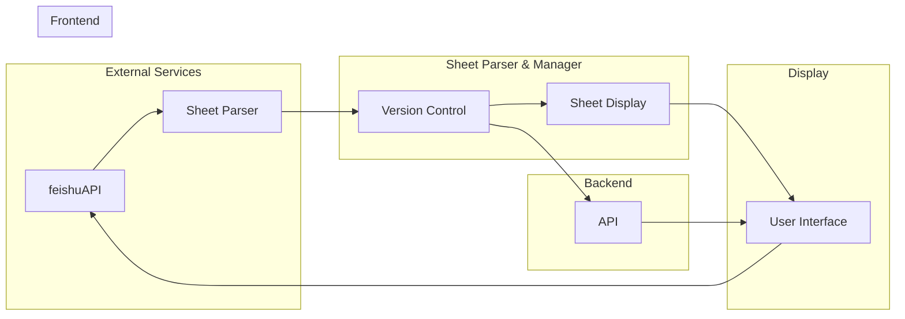
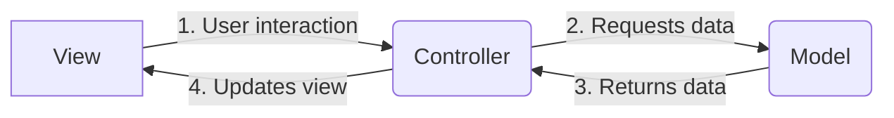

<h1 align="center" style="border-bottom: none">
    <b>
        <a href="https://docker.nsddd.top">go-project-layout</a><br>
    </b>
    ⭐️  Template for a typical module written on Go.  ⭐️ <br>
</h1>

<p align=center>
<a href="https://goreportcard.com/report/github.com/kubecub/go-project-layout"></a>
<a href="https://github.com/issues?q=org%3Akubecub+is%3Aissue+label%3A%22good+first+issue%22+no%3Aassignee"></a>
<a href="https://github.com/kubecub/go-project-layout"></a>
<a href="https://join.slack.com/t/kubecub/shared_invite/zt-1se0k2bae-lkYzz0_T~BYh3rjkvlcUqQ"></a>
<a href="https://github.com/kubecub/go-project-layout/blob/main/LICENSE"></a>
<a href="https://golang.org/"></a>
</p>

</p>

<p align="center">
    <a href="./README.md"><b>English</b></a> •
    <a href="./README_zh-CN.md"><b>中文</b></a>
</p>

</p>

## 🧩 Awesome features

At Github, we want to start new projects faster using best practices with a predefined structure and focusing on core ideas implementation rather than wasting time on environment configuration and copying boilerplate code.

I defined a spec template that I could use to quickly start building a full-fledged project.

In each directory, there is a README.md and an OWNERS, which explains what the directory does and who owns it.


## 🛫 Quick start 

> **Note**: You can get started quickly with go-project-layout.

1. Generate a new repository from the template.
2. Clone the repository locally.
3. Update files, read the README files in each directory.
4. Write your code and tests. 

<details>
  <summary>Work with Makefile</summary>

```bash
❯ make help    # show help
❯ make build   # build binary
```

</details>
<details>
  <summary>Work with actions</summary>


```bash

```

</details>
<details>
  <summary>Work with Tools</summary>

```bash
❯ make tools
```

</details>
<details>
  <summary>Work with Docker</summary>

```bash
$ make go-1.11 # or go-1.12, etc.
/src# make go-env 2>/dev/null | grep GOVERSION
# GOVERSION:   1.11.13
/src# make test
```

</details>


## 🕋 architecture diagram


**MVC Architecture Design:**


## 🤖 File Directory Description

## 🗓️ community meeting

We welcome everyone to join us and contribute to go-project-layout, whether you are new to open source or professional. We are committed to promoting an open source culture, so we offer community members neighborhood prizes and reward money in recognition of their contributions. We believe that by working together, we can build a strong community and make valuable open source tools and resources available to more people. So if you are interested in go-project-layout, please join our community and start contributing your ideas and skills!

We take notes of each [biweekly meeting](https://github.com/kubecub/go-project-layout/issues/2) in [GitHub discussions](https://github.com/kubecub/go-project-layout/discussions/categories/meeting), and our minutes are written in [Google Docs](https://docs.google.com/document/d/1nx8MDpuG74NASx081JcCpxPgDITNTpIIos0DS6Vr9GU/edit?usp=sharing).

go-project-layout maintains a [public roadmap](https://github.com/kubecub/community/tree/main/roadmaps). It gives a a high-level view of the main priorities for the project, the maturity of different features and projects, and how to influence the project direction.

## 🤼‍ Contributing & Development

kubecub Our goal is to build a top-level open source community. We have a set of standards, in the [Community repository](https://github.com/kubecub/community).

If you'd like to contribute to this go-project-layout repository, please read our [contributor documentation](https://github.com/kubecub/go-project-layout/blob/main/CONTRIBUTING.md).

Before you start, please make sure your changes are in demand. The best for that is to create a [new discussion](https://github.com/kubecub/go-project-layout/discussions/new/choose) OR [Slack Communication](https://join.slack.com/t/kubecub/shared_invite/zt-1se0k2bae-lkYzz0_T~BYh3rjkvlcUqQ), or if you find an issue, [report it](https://github.com/kubecub/go-project-layout/issues/new/choose) first.


## 🚨 License

Sealer is licensed under the Apache License, Version 2.0. See [LICENSE](https://github.com/kubecub/go-project-layout/tree/main/LICENSE) for the full license text.

[](https://app.fossa.com/projects/git%2Bgithub.com%2Fkubecub%2Fgo-project-layout?ref=badge_large)


## 🔮 Thanks to our contributors!

<a href="https://github.com/kubecub/go-project-layout/graphs/contributors">
  
</a>
