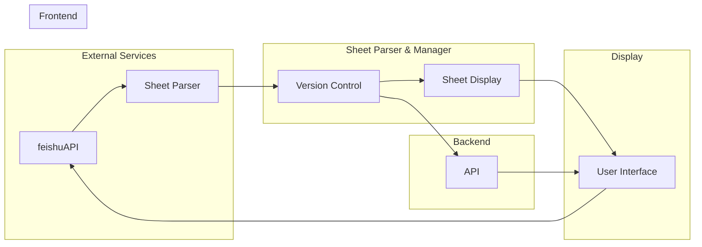
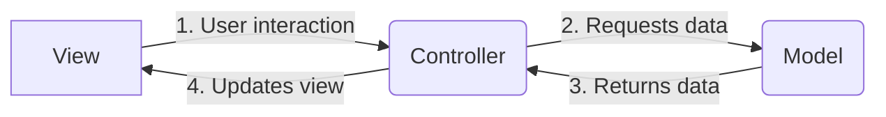

<h1 align="center" style="border-bottom: none">
    <b>
        <a href="https://docker.nsddd.top">go-project-layout</a><br>
    </b>
</h1>
<h3 align="center" style="border-bottom: none">
      ⭐️  Template for a typical module written on Go.  ⭐️ <br>
<h3>


<p align=center>
<a href="https://goreportcard.com/report/github.com/kubecub/go-project-layout"></a>
<a href="https://github.com/issues?q=org%kubecub+is%3Aissue+label%3A%22good+first+issue%22+no%3Aassignee"></a>
<a href="https://github.com/kubecub/go-project-layout"></a>
<a href="https://join.slack.com/t/kubecub/shared_invite/zt-1se0k2bae-lkYzz0_T~BYh3rjkvlcUqQ"></a>
<a href="https://github.com/kubecub/go-project-layout/blob/main/LICENSE"></a>
<a href="https://golang.org/"></a>
</p>

</p>

<p align="center">
    <a href="./README.md"><b>English</b></a> •
    <a href="./README_zh-CN.md"><b>中文</b></a>
</p>

</p>

----

## 🧩 Awesome features

At Github, we want to start new projects faster using best practices with a predefined structure and focusing on core ideas implementation rather than wasting time on environment configuration and copying boilerplate code.

I defined a spec template that I could use to quickly start building a full-fledged project.

In each directory, there is a README.md and an OWNERS, which explains what the directory does and who owns it.

**Labels denger:**
Read about the [go-project-layout](https://github.com/kubecub/go-project-layout/labels) tag design


## 🛫 Quick start 

> **Note**: You can get started quickly with go-project-layout.

1. Generate a [new repository](https://github.com/kubecub/go-project-layout/generate) from the template.
2. Clone the repository locally.
3. Update files, read the README files in each directory.
4. Write your code and tests. 

<details>
  <summary>Work with Makefile</summary>

```bash
❯ make help    # show help
❯ make build   # build binary
```

</details>
<details>
  <summary>Work with actions</summary>

Actions provide handling of PR and issue.
We used the bot [🚀@kubbot](https://github.com/kubbot), It can detect issues in Chinese and translate them to English, and you can interact with it using the command `/comment`.

Comment in an issue:

```bash
❯ /intive
```

</details>
<details>
  <summary>Work with Tools</summary>

```bash
❯ make tools
```

</details>
<details>
  <summary>Work with Docker</summary>

```bash
❯ make deploy
```

</details>


## 🕋 architecture diagram


**MVC Architecture Design:**


## 🤖 File Directory Description

Catalog standardization design structure:

```bash
.go-project-layout
├── CONTRIBUTING.md          # Contribution guidelines
├── LICENSE                  # License information
├── Makefile                 # Makefile for building and running the project
├── README.md                # Project overview in English
├── README_zh-CN.md          # Project overview in Chinese
├── api                      # API-related files
│   ├── OWNERS               # API owners
│   └── README.md            # API documentation
├── assets                   # Static assets, such as images and stylesheets
│   └── README.md            # Assets documentation
├── build                    # Build-related files
│   ├── OWNERS               # Build owners
│   └── README.md            # Build documentation
├── cmd                      # Command-line tools and entry points
│   ├── OWNERS               # Command owners
│   └── README.md            # Command documentation
├── configs                  # Configuration files
│   ├── OWNERS               # Configuration owners
│   ├── README.md            # Configuration documentation
│   └── config.yaml          # Main configuration file
├── deploy                   # Deployment-related files
│   ├── OWNERS               # Deployment owners
│   └── README.md            # Deployment documentation
├── docs                     # Project documentation
│   ├── OWNERS               # Documentation owners
│   └── README.md            # Documentation index
├── examples                 # Example code and usage
│   ├── OWNERS               # Example owners
│   └── README.md            # Example documentation
├── init                     # Initialization files
│   ├── OWNERS               # Initialization owners
│   └── README.md            # Initialization documentation
├── internal                 # Internal application code
│   ├── OWNERS               # Internal code owners
│   ├── README.md            # Internal code documentation
│   ├── app                  # Application logic
│   ├── pkg                  # Internal packages
│   └── utils                # Utility functions and helpers
├── pkg                      # Public packages and libraries
│   ├── OWNERS               # Package owners
│   ├── README.md            # Package documentation
│   ├── common               # Common utilities and helpers
│   ├── log                  # Log utilities
│   ├── tools                # Tooling and scripts
│   ├── utils                # General utility functions
│   └── version              # Version information
├── scripts                  # Scripts for development and automation
│   ├── LICENSE_TEMPLATES    # License templates
│   ├── OWNERS               # Script owners
│   ├── README.md            # Script documentation
│   ├── githooks             # Git hooks for development
│   └── make-rules           # Makefile rules and scripts
├── test                     # Test files and test-related utilities
│   ├── OWNERS               # Test owners
│   └── README.md            # Test documentation
├── third_party              # Third-party dependencies and libraries
│   └── README.md            # Third-party documentation
├── tools                    # Tooling and utilities for development
│   └── README.md            # Tool documentation
└── web                      # Web-related files, such as HTML and CSS
    ├── OWNERS               # Web owners
    └── README.md            # Web documentation
```

## 🗓️ community meeting

We welcome everyone to join us and contribute to go-project-layout, whether you are new to open source or professional. We are committed to promoting an open source culture, so we offer community members neighborhood prizes and reward money in recognition of their contributions. We believe that by working together, we can build a strong community and make valuable open source tools and resources available to more people. So if you are interested in go-project-layout, please join our community and start contributing your ideas and skills!

We take notes of each [biweekly meeting](https://github.com/kubecub/go-project-layout/issues/2) in [GitHub discussions](https://github.com/kubecub/go-project-layout/discussions/categories/meeting), and our minutes are written in [Google Docs](https://docs.google.com/document/d/1nx8MDpuG74NASx081JcCpxPgDITNTpIIos0DS6Vr9GU/edit?usp=sharing).

go-project-layout maintains a [public roadmap](https://github.com/kubecub/community/tree/main/roadmaps). It gives a a high-level view of the main priorities for the project, the maturity of different features and projects, and how to influence the project direction.

## 🤼‍ Contributing & Development

kubecub Our goal is to build a top-level open source community. We have a set of standards, in the [Community repository](https://github.com/kubecub/community).

If you'd like to contribute to this go-project-layout repository, please read our [contributor documentation](https://github.com/kubecub/go-project-layout/blob/main/CONTRIBUTING.md).

Before you start, please make sure your changes are in demand. The best for that is to create a [new discussion](https://github.com/kubecub/go-project-layout/discussions/new/choose) OR [Slack Communication](https://join.slack.com/t/kubecub/shared_invite/zt-1se0k2bae-lkYzz0_T~BYh3rjkvlcUqQ), or if you find an issue, [report it](https://github.com/kubecub/go-project-layout/issues/new/choose) first.


## 🚨 License

Sealer is licensed under the Apache License, Version 2.0. See [LICENSE](https://github.com/kubecub/go-project-layout/tree/main/LICENSE) for the full license text.

[](https://app.fossa.com/projects/git%2Bgithub.com%2Fkubecub%2Fgo-project-layout?ref=badge_large)


## 🔮 Thanks to our contributors!

<a href="https://github.com/kubecub/go-project-layout/graphs/contributors">
  
</a>
